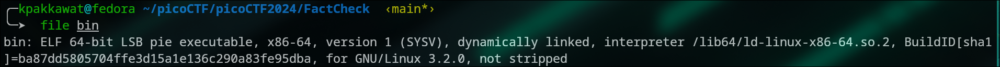
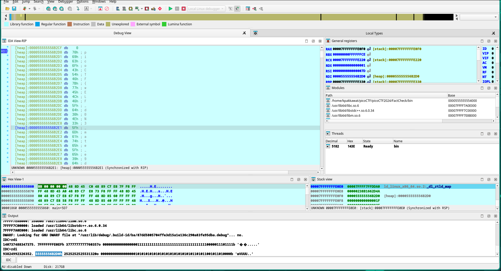

# FactCheck Challenge Writeup

## 1. File Identification

```bash
file bin
```


---

## 2. Extracting Strings

```bash
strings bin > string_output.txt
```
From the output, part of the flag is visible:

> `picoCTF{wELF_d0N3_mate_`

---

## 3. Running the Binary

```bash
./bin
```
*No output was produced. Let's disassemble the binary file to see what's inside the program using IDA.*

---

## 4. Disassembly with IDA

In the `main` function, I get this assembly:
<details>
<summary>Click to expand assembly code</summary>

```asm
; int __fastcall main(int argc, const char **argv, const char **envp)
.text:0000555555555289                 public main
.text:0000555555555289 main            proc near               ; DATA XREF: _start+21↑o
.text:0000555555555289
.text:0000555555555289 var_241         = byte ptr -241h
.text:0000555555555289 var_240         = byte ptr -240h
.text:0000555555555289 var_220         = byte ptr -220h
.text:0000555555555289 var_200         = byte ptr -200h
.text:0000555555555289 var_1E0         = byte ptr -1E0h
.text:0000555555555289 var_1C0         = byte ptr -1C0h
.text:0000555555555289 var_1A0         = byte ptr -1A0h
.text:0000555555555289 var_180         = byte ptr -180h
.text:0000555555555289 var_160         = byte ptr -160h
.text:0000555555555289 var_140         = byte ptr -140h
.text:0000555555555289 var_120         = byte ptr -120h
.text:0000555555555289 var_100         = byte ptr -100h
.text:0000555555555289 var_E0          = byte ptr -0E0h
.text:0000555555555289 var_C0          = byte ptr -0C0h
.text:0000555555555289 var_A0          = byte ptr -0A0h
.text:0000555555555289 var_80          = byte ptr -80h
.text:0000555555555289 var_60          = byte ptr -60h
.text:0000555555555289 var_40          = byte ptr -40h
.text:0000555555555289 var_18          = qword ptr -18h
.text:0000555555555289
.text:0000555555555289 ; __unwind { // __gxx_personality_v0
.text:0000555555555289                 endbr64
.text:000055555555528D                 push    rbp
.text:000055555555528E                 mov     rbp, rsp
.text:0000555555555291                 push    rbx
.text:0000555555555292                 sub     rsp, 248h
.text:0000555555555299                 mov     rax, fs:28h
.text:00005555555552A2                 mov     [rbp+var_18], rax
.text:00005555555552A6                 xor     eax, eax
.text:00005555555552A8                 lea     rax, [rbp+var_241]
.text:00005555555552AF                 mov     rdi, rax
.text:00005555555552B2                 call    __ZNSaIcEC1Ev   ; std::allocator<char>::allocator(void)
.text:00005555555552B7                 lea     rdx, [rbp+var_241]
.text:00005555555552BE                 lea     rax, [rbp+var_240]
.text:00005555555552C5                 lea     rsi, aPicoctfWelfD0n ; "picoCTF{wELF_d0N3_mate_"
.text:00005555555552CC                 mov     rdi, rax
.text:00005555555552CF ;   try {
.text:00005555555552CF                 call    __ZNSt7__cxx1112basic_stringIcSt11char_traitsIcESaIcEEC1EPKcRKS3_ ; std::string::basic_string(char const*,std::allocator<char> const&)
.text:00005555555552CF ;   } // starts at 5555555552CF
.text:00005555555552D4                 lea     rax, [rbp+var_241]
.text:00005555555552DB                 mov     rdi, rax
.text:00005555555552DE                 call    __ZNSaIcED1Ev   ; std::allocator<char>::~allocator()
.text:00005555555552E3                 lea     rax, [rbp+var_241]
.text:00005555555552EA                 mov     rdi, rax
.text:00005555555552ED                 call    __ZNSaIcEC1Ev   ; std::allocator<char>::allocator(void)
.text:00005555555552F2                 lea     rdx, [rbp+var_241]
.text:00005555555552F9                 lea     rax, [rbp+var_220]
.text:0000555555555300                 lea     rsi, a0         ; "0"
.text:0000555555555307                 mov     rdi, rax
.text:000055555555530A ;   try {
.text:000055555555530A                 call    __ZNSt7__cxx1112basic_stringIcSt11char_traitsIcESaIcEEC1EPKcRKS3_ ; std::string::basic_string(char const*,std::allocator<char> const&)
.text:000055555555530A ;   } // starts at 55555555530A
.text:000055555555530F                 lea     rax, [rbp+var_241]
.text:0000555555555316                 mov     rdi, rax
.text:0000555555555319                 call    __ZNSaIcED1Ev   ; std::allocator<char>::~allocator()
.text:000055555555531E                 lea     rax, [rbp+var_241]
.text:0000555555555325                 mov     rdi, rax
.text:0000555555555328                 call    __ZNSaIcEC1Ev   ; std::allocator<char>::allocator(void)
.text:000055555555532D                 lea     rdx, [rbp+var_241]
.text:0000555555555334                 lea     rax, [rbp+var_200]
.text:000055555555533B                 lea     rsi, a5         ; "5"
.text:0000555555555342                 mov     rdi, rax
.text:0000555555555345 ;   try {
.text:0000555555555345                 call    __ZNSt7__cxx1112basic_stringIcSt11char_traitsIcESaIcEEC1EPKcRKS3_ ; std::string::basic_string(char const*,std::allocator<char> const&)
.text:0000555555555345 ;   } // starts at 555555555345
.text:000055555555534A                 lea     rax, [rbp+var_241]
.text:0000555555555351                 mov     rdi, rax
.text:0000555555555354                 call    __ZNSaIcED1Ev   ; std::allocator<char>::~allocator()
.text:0000555555555359                 lea     rax, [rbp+var_241]
.text:0000555555555360                 mov     rdi, rax
.text:0000555555555363                 call    __ZNSaIcEC1Ev   ; std::allocator<char>::allocator(void)
.text:0000555555555368                 lea     rdx, [rbp+var_241]
.text:000055555555536F                 lea     rax, [rbp+var_1E0]
.text:0000555555555376                 lea     rsi, aD         ; "d"
.text:000055555555537D                 mov     rdi, rax
.text:0000555555555380 ;   try {
.text:0000555555555380                 call    __ZNSt7__cxx1112basic_stringIcSt11char_traitsIcESaIcEEC1EPKcRKS3_ ; std::string::basic_string(char const*,std::allocator<char> const&)
.text:0000555555555380 ;   } // starts at 555555555380
.text:0000555555555385                 lea     rax, [rbp+var_241]
.text:000055555555538C                 mov     rdi, rax
.text:000055555555538F                 call    __ZNSaIcED1Ev   ; std::allocator<char>::~allocator()
.text:0000555555555394                 lea     rax, [rbp+var_241]
.text:000055555555539B                 mov     rdi, rax
.text:000055555555539E                 call    __ZNSaIcEC1Ev   ; std::allocator<char>::allocator(void)
.text:00005555555553A3                 lea     rdx, [rbp+var_241]
.text:00005555555553AA                 lea     rax, [rbp+var_1C0]
.text:00005555555553B1                 lea     rsi, a3         ; "3"
.text:00005555555553B8                 mov     rdi, rax
.text:00005555555553BB ;   try {
.text:00005555555553BB                 call    __ZNSt7__cxx1112basic_stringIcSt11char_traitsIcESaIcEEC1EPKcRKS3_ ; std::string::basic_string(char const*,std::allocator<char> const&)
.text:00005555555553BB ;   } // starts at 5555555553BB
.text:00005555555553C0                 lea     rax, [rbp+var_241]
.text:00005555555553C7                 mov     rdi, rax
.text:00005555555553CA                 call    __ZNSaIcED1Ev   ; std::allocator<char>::~allocator()
.text:00005555555553CF                 lea     rax, [rbp+var_241]
.text:00005555555553D6                 mov     rdi, rax
.text:00005555555553D9                 call    __ZNSaIcEC1Ev   ; std::allocator<char>::allocator(void)
.text:00005555555553DE                 lea     rdx, [rbp+var_241]
.text:00005555555553E5                 lea     rax, [rbp+var_1A0]
.text:00005555555553EC                 lea     rsi, a2         ; "2"
.text:00005555555553F3                 mov     rdi, rax
.text:00005555555553F6 ;   try {
.text:00005555555553F6                 call    __ZNSt7__cxx1112basic_stringIcSt11char_traitsIcESaIcEEC1EPKcRKS3_ ; std::string::basic_string(char const*,std::allocator<char> const&)
.text:00005555555553F6 ;   } // starts at 5555555553F6
.text:00005555555553FB                 lea     rax, [rbp+var_241]
.text:0000555555555402                 mov     rdi, rax
.text:0000555555555405                 call    __ZNSaIcED1Ev   ; std::allocator<char>::~allocator()
.text:000055555555540A                 lea     rax, [rbp+var_241]
.text:0000555555555411                 mov     rdi, rax
.text:0000555555555414                 call    __ZNSaIcEC1Ev   ; std::allocator<char>::allocator(void)
.text:0000555555555419                 lea     rdx, [rbp+var_241]
.text:0000555555555420                 lea     rax, [rbp+var_180]
.text:0000555555555427                 lea     rsi, aA         ; "a"
.text:000055555555542E                 mov     rdi, rax
.text:0000555555555431 ;   try {
.text:0000555555555431                 call    __ZNSt7__cxx1112basic_stringIcSt11char_traitsIcESaIcEEC1EPKcRKS3_ ; std::string::basic_string(char const*,std::allocator<char> const&)
.text:0000555555555431 ;   } // starts at 555555555431
.text:0000555555555436                 lea     rax, [rbp+var_241]
.text:000055555555543D                 mov     rdi, rax
.text:0000555555555440                 call    __ZNSaIcED1Ev   ; std::allocator<char>::~allocator()
.text:0000555555555445                 lea     rax, [rbp+var_241]
.text:000055555555544C                 mov     rdi, rax
.text:000055555555544F                 call    __ZNSaIcEC1Ev   ; std::allocator<char>::allocator(void)
.text:0000555555555454                 lea     rdx, [rbp+var_241]
.text:000055555555545B                 lea     rax, [rbp+var_160]
.text:0000555555555462                 lea     rsi, aA         ; "a"
.text:0000555555555469                 mov     rdi, rax
.text:000055555555546C ;   try {
.text:000055555555546C                 call    __ZNSt7__cxx1112basic_stringIcSt11char_traitsIcESaIcEEC1EPKcRKS3_ ; std::string::basic_string(char const*,std::allocator<char> const&)
.text:000055555555546C ;   } // starts at 55555555546C
.text:0000555555555471                 lea     rax, [rbp+var_241]
.text:0000555555555478                 mov     rdi, rax
.text:000055555555547B                 call    __ZNSaIcED1Ev   ; std::allocator<char>::~allocator()
.text:0000555555555480                 lea     rax, [rbp+var_241]
.text:0000555555555487                 mov     rdi, rax
.text:000055555555548A                 call    __ZNSaIcEC1Ev   ; std::allocator<char>::allocator(void)
.text:000055555555548F                 lea     rdx, [rbp+var_241]
.text:0000555555555496                 lea     rax, [rbp+var_140]
.text:000055555555549D                 lea     rsi, aE         ; "e"
.text:00005555555554A4                 mov     rdi, rax
.text:00005555555554A7 ;   try {
.text:00005555555554A7                 call    __ZNSt7__cxx1112basic_stringIcSt11char_traitsIcESaIcEEC1EPKcRKS3_ ; std::string::basic_string(char const*,std::allocator<char> const&)
.text:00005555555554A7 ;   } // starts at 5555555554A7
.text:00005555555554AC                 lea     rax, [rbp+var_241]
.text:00005555555554B3                 mov     rdi, rax
.text:00005555555554B6                 call    __ZNSaIcED1Ev   ; std::allocator<char>::~allocator()
.text:00005555555554BB                 lea     rax, [rbp+var_241]
.text:00005555555554C2                 mov     rdi, rax
.text:00005555555554C5                 call    __ZNSaIcEC1Ev   ; std::allocator<char>::allocator(void)
.text:00005555555554CA                 lea     rdx, [rbp+var_241]
.text:00005555555554D1                 lea     rax, [rbp+var_120]
.text:00005555555554D8                 lea     rsi, aE         ; "e"
.text:00005555555554DF                 mov     rdi, rax
.text:00005555555554E2 ;   try {
.text:00005555555554E2                 call    __ZNSt7__cxx1112basic_stringIcSt11char_traitsIcESaIcEEC1EPKcRKS3_ ; std::string::basic_string(char const*,std::allocator<char> const&)
.text:00005555555554E2 ;   } // starts at 5555555554E2
.text:00005555555554E7                 lea     rax, [rbp+var_241]
.text:00005555555554EE                 mov     rdi, rax
.text:00005555555554F1                 call    __ZNSaIcED1Ev   ; std::allocator<char>::~allocator()
.text:00005555555554F6                 lea     rax, [rbp+var_241]
.text:00005555555554FD                 mov     rdi, rax
.text:0000555555555500                 call    __ZNSaIcEC1Ev   ; std::allocator<char>::allocator(void)
.text:0000555555555505                 lea     rdx, [rbp+var_241]
.text:000055555555550C                 lea     rax, [rbp+var_100]
.text:0000555555555513                 lea     rsi, aD         ; "d"
.text:000055555555551A                 mov     rdi, rax
.text:000055555555551D ;   try {
.text:000055555555551D                 call    __ZNSt7__cxx1112basic_stringIcSt11char_traitsIcESaIcEEC1EPKcRKS3_ ; std::string::basic_string(char const*,std::allocator<char> const&)
.text:000055555555551D ;   } // starts at 55555555551D
.text:0000555555555522                 lea     rax, [rbp+var_241]
.text:0000555555555529                 mov     rdi, rax
.text:000055555555552C                 call    __ZNSaIcED1Ev   ; std::allocator<char>::~allocator()
.text:0000555555555531                 lea     rax, [rbp+var_241]
.text:0000555555555538                 mov     rdi, rax
.text:000055555555553B                 call    __ZNSaIcEC1Ev   ; std::allocator<char>::allocator(void)
.text:0000555555555540                 lea     rdx, [rbp+var_241]
.text:0000555555555547                 lea     rax, [rbp+var_E0]
.text:000055555555554E                 lea     rsi, aB         ; "b"
.text:0000555555555555                 mov     rdi, rax
.text:0000555555555558 ;   try {
.text:0000555555555558                 call    __ZNSt7__cxx1112basic_stringIcSt11char_traitsIcESaIcEEC1EPKcRKS3_ ; std::string::basic_string(char const*,std::allocator<char> const&)
.text:0000555555555558 ;   } // starts at 555555555558
.text:000055555555555D                 lea     rax, [rbp+var_241]
.text:0000555555555564                 mov     rdi, rax
.text:0000555555555567                 call    __ZNSaIcED1Ev   ; std::allocator<char>::~allocator()
.text:000055555555556C                 lea     rax, [rbp+var_241]
.text:0000555555555573                 mov     rdi, rax
.text:0000555555555576                 call    __ZNSaIcEC1Ev   ; std::allocator<char>::allocator(void)
.text:000055555555557B                 lea     rdx, [rbp+var_241]
.text:0000555555555582                 lea     rax, [rbp+var_C0]
.text:0000555555555589                 lea     rsi, aE         ; "e"
.text:0000555555555590                 mov     rdi, rax
.text:0000555555555593 ;   try {
.text:0000555555555593                 call    __ZNSt7__cxx1112basic_stringIcSt11char_traitsIcESaIcEEC1EPKcRKS3_ ; std::string::basic_string(char const*,std::allocator<char> const&)
.text:0000555555555593 ;   } // starts at 555555555593
.text:0000555555555598                 lea     rax, [rbp+var_241]
.text:000055555555559F                 mov     rdi, rax
.text:00005555555555A2                 call    __ZNSaIcED1Ev   ; std::allocator<char>::~allocator()
.text:00005555555555A7                 lea     rax, [rbp+var_241]
.text:00005555555555AE                 mov     rdi, rax
.text:00005555555555B1                 call    __ZNSaIcEC1Ev   ; std::allocator<char>::allocator(void)
.text:00005555555555B6                 lea     rdx, [rbp+var_241]
.text:00005555555555BD                 lea     rax, [rbp+var_A0]
.text:00005555555555C4                 lea     rsi, a6         ; "6"
.text:00005555555555CB                 mov     rdi, rax
.text:00005555555555CE ;   try {
.text:00005555555555CE                 call    __ZNSt7__cxx1112basic_stringIcSt11char_traitsIcESaIcEEC1EPKcRKS3_ ; std::string::basic_string(char const*,std::allocator<char> const&)
.text:00005555555555CE ;   } // starts at 5555555555CE
.text:00005555555555D3                 lea     rax, [rbp+var_241]
.text:00005555555555DA                 mov     rdi, rax
.text:00005555555555DD                 call    __ZNSaIcED1Ev   ; std::allocator<char>::~allocator()
.text:00005555555555E2                 lea     rax, [rbp+var_241]
.text:00005555555555E9                 mov     rdi, rax
.text:00005555555555EC                 call    __ZNSaIcEC1Ev   ; std::allocator<char>::allocator(void)
.text:00005555555555F1                 lea     rdx, [rbp+var_241]
.text:00005555555555F8                 lea     rax, [rbp+var_80]
.text:00005555555555FC                 lea     rsi, aC         ; "c"
.text:0000555555555603                 mov     rdi, rax
.text:0000555555555606 ;   try {
.text:0000555555555606                 call    __ZNSt7__cxx1112basic_stringIcSt11char_traitsIcESaIcEEC1EPKcRKS3_ ; std::string::basic_string(char const*,std::allocator<char> const&)
.text:0000555555555606 ;   } // starts at 555555555606
.text:000055555555560B                 lea     rax, [rbp+var_241]
.text:0000555555555612                 mov     rdi, rax
.text:0000555555555615                 call    __ZNSaIcED1Ev   ; std::allocator<char>::~allocator()
.text:000055555555561A                 lea     rax, [rbp+var_241]
.text:0000555555555621                 mov     rdi, rax
.text:0000555555555624                 call    __ZNSaIcEC1Ev   ; std::allocator<char>::allocator(void)
.text:0000555555555629                 lea     rdx, [rbp+var_241]
.text:0000555555555630                 lea     rax, [rbp+var_60]
.text:0000555555555634                 lea     rsi, a9         ; "9"
.text:000055555555563B                 mov     rdi, rax
.text:000055555555563E ;   try {
.text:000055555555563E                 call    __ZNSt7__cxx1112basic_stringIcSt11char_traitsIcESaIcEEC1EPKcRKS3_ ; std::string::basic_string(char const*,std::allocator<char> const&)
.text:000055555555563E ;   } // starts at 55555555563E
.text:0000555555555643                 lea     rax, [rbp+var_241]
.text:000055555555564A                 mov     rdi, rax
.text:000055555555564D                 call    __ZNSaIcED1Ev   ; std::allocator<char>::~allocator()
.text:0000555555555652                 lea     rax, [rbp+var_241]
.text:0000555555555659                 mov     rdi, rax
.text:000055555555565C                 call    __ZNSaIcEC1Ev   ; std::allocator<char>::allocator(void)
.text:0000555555555661                 lea     rdx, [rbp+var_241]
.text:0000555555555668                 lea     rax, [rbp+var_40]
.text:000055555555566C                 lea     rsi, a8         ; "8"
.text:0000555555555673                 mov     rdi, rax
.text:0000555555555676 ;   try {
.text:0000555555555676                 call    __ZNSt7__cxx1112basic_stringIcSt11char_traitsIcESaIcEEC1EPKcRKS3_ ; std::string::basic_string(char const*,std::allocator<char> const&)
.text:0000555555555676 ;   } // starts at 555555555676
.text:000055555555567B                 lea     rax, [rbp+var_241]
.text:0000555555555682                 mov     rdi, rax
.text:0000555555555685                 call    __ZNSaIcED1Ev   ; std::allocator<char>::~allocator()
.text:000055555555568A                 lea     rax, [rbp+var_200]
.text:0000555555555691                 mov     esi, 0
.text:0000555555555696                 mov     rdi, rax
.text:0000555555555699 ;   try {
.text:0000555555555699                 call    __ZNSt7__cxx1112basic_stringIcSt11char_traitsIcESaIcEEixEm ; std::string::operator[](ulong)
.text:000055555555569E                 movzx   eax, byte ptr [rax]
.text:00005555555556A1                 cmp     al, 41h ; 'A'
.text:00005555555556A3                 setle   al
.text:00005555555556A6                 test    al, al
.text:00005555555556A8                 jz      short loc_5555555556C3
.text:00005555555556AA                 lea     rdx, [rbp+var_C0]
.text:00005555555556B1                 lea     rax, [rbp+var_240]
.text:00005555555556B8                 mov     rsi, rdx
.text:00005555555556BB                 mov     rdi, rax
.text:00005555555556BE                 call    __ZNSt7__cxx1112basic_stringIcSt11char_traitsIcESaIcEEpLERKS4_ ; std::string::operator+=(std::string const&)
.text:00005555555556C3
.text:00005555555556C3 loc_5555555556C3:                       ; CODE XREF: main+41F↑j
.text:00005555555556C3                 lea     rax, [rbp+var_A0]
.text:00005555555556CA                 mov     esi, 0
.text:00005555555556CF                 mov     rdi, rax
.text:00005555555556D2                 call    __ZNSt7__cxx1112basic_stringIcSt11char_traitsIcESaIcEEixEm ; std::string::operator[](ulong)
.text:00005555555556D7                 movzx   eax, byte ptr [rax]
.text:00005555555556DA                 cmp     al, 41h ; 'A'
.text:00005555555556DC                 setnz   al
.text:00005555555556DF                 test    al, al
.text:00005555555556E1                 jz      short loc_5555555556F9
.text:00005555555556E3                 lea     rdx, [rbp+var_60]
.text:00005555555556E7                 lea     rax, [rbp+var_240]
.text:00005555555556EE                 mov     rsi, rdx
.text:00005555555556F1                 mov     rdi, rax
.text:00005555555556F4                 call    __ZNSt7__cxx1112basic_stringIcSt11char_traitsIcESaIcEEpLERKS4_ ; std::string::operator+=(std::string const&)
.text:00005555555556F9
.text:00005555555556F9 loc_5555555556F9:                       ; CODE XREF: main+458↑j
.text:00005555555556F9                 lea     rdx, aHello     ; "Hello"
.text:0000555555555700                 lea     rax, aWorld     ; "World"
.text:0000555555555707                 cmp     rdx, rax
.text:000055555555570A                 jnz     short loc_555555555725
.text:000055555555570C                 lea     rdx, [rbp+var_1E0]
.text:0000555555555713                 lea     rax, [rbp+var_240]
.text:000055555555571A                 mov     rsi, rdx
.text:000055555555571D                 mov     rdi, rax
.text:0000555555555720                 call    __ZNSt7__cxx1112basic_stringIcSt11char_traitsIcESaIcEEpLERKS4_ ; std::string::operator+=(std::string const&)
.text:0000555555555725
.text:0000555555555725 loc_555555555725:                       ; CODE XREF: main+481↑j
.text:0000555555555725                 lea     rax, [rbp+var_1C0]
.text:000055555555572C                 mov     esi, 0
.text:0000555555555731                 mov     rdi, rax
.text:0000555555555734                 call    __ZNSt7__cxx1112basic_stringIcSt11char_traitsIcESaIcEEixEm ; std::string::operator[](ulong)
.text:0000555555555739                 movzx   eax, byte ptr [rax]
.text:000055555555573C                 movsx   ebx, al
.text:000055555555573F                 lea     rax, [rbp+var_140]
.text:0000555555555746                 mov     esi, 0
.text:000055555555574B                 mov     rdi, rax
.text:000055555555574E                 call    __ZNSt7__cxx1112basic_stringIcSt11char_traitsIcESaIcEEixEm ; std::string::operator[](ulong)
.text:0000555555555753                 movzx   eax, byte ptr [rax]
.text:0000555555555756                 movsx   eax, al
.text:0000555555555759                 sub     ebx, eax
.text:000055555555575B                 mov     eax, ebx
.text:000055555555575D                 cmp     eax, 3
.text:0000555555555760                 setz    al
.text:0000555555555763                 test    al, al
.text:0000555555555765                 jz      short loc_555555555780
.text:0000555555555767                 lea     rdx, [rbp+var_1C0]
.text:000055555555576E                 lea     rax, [rbp+var_240]
.text:0000555555555775                 mov     rsi, rdx
.text:0000555555555778                 mov     rdi, rax
.text:000055555555577B                 call    __ZNSt7__cxx1112basic_stringIcSt11char_traitsIcESaIcEEpLERKS4_ ; std::string::operator+=(std::string const&)
.text:0000555555555780
.text:0000555555555780 loc_555555555780:                       ; CODE XREF: main+4DC↑j
.text:0000555555555780                 lea     rdx, [rbp+var_1E0]
.text:0000555555555787                 lea     rax, [rbp+var_240]
.text:000055555555578E                 mov     rsi, rdx
.text:0000555555555791                 mov     rdi, rax
.text:0000555555555794                 call    __ZNSt7__cxx1112basic_stringIcSt11char_traitsIcESaIcEEpLERKS4_ ; std::string::operator+=(std::string const&)
.text:0000555555555799                 lea     rdx, [rbp+var_180]
.text:00005555555557A0                 lea     rax, [rbp+var_240]
.text:00005555555557A7                 mov     rsi, rdx
.text:00005555555557AA                 mov     rdi, rax
.text:00005555555557AD                 call    __ZNSt7__cxx1112basic_stringIcSt11char_traitsIcESaIcEEpLERKS4_ ; std::string::operator+=(std::string const&)
.text:00005555555557B2                 lea     rax, [rbp+var_160]
.text:00005555555557B9                 mov     esi, 0
.text:00005555555557BE                 mov     rdi, rax
.text:00005555555557C1                 call    __ZNSt7__cxx1112basic_stringIcSt11char_traitsIcESaIcEEixEm ; std::string::operator[](ulong)
.text:00005555555557C6                 movzx   eax, byte ptr [rax]
.text:00005555555557C9                 cmp     al, 47h ; 'G'
.text:00005555555557CB                 setz    al
.text:00005555555557CE                 test    al, al
.text:00005555555557D0                 jz      short loc_5555555557EB
.text:00005555555557D2                 lea     rdx, [rbp+var_160]
.text:00005555555557D9                 lea     rax, [rbp+var_240]
.text:00005555555557E0                 mov     rsi, rdx
.text:00005555555557E3                 mov     rdi, rax
.text:00005555555557E6                 call    __ZNSt7__cxx1112basic_stringIcSt11char_traitsIcESaIcEEpLERKS4_ ; std::string::operator+=(std::string const&)
.text:00005555555557EB
.text:00005555555557EB loc_5555555557EB:                       ; CODE XREF: main+547↑j
.text:00005555555557EB                 lea     rdx, [rbp+var_1A0]
.text:00005555555557F2                 lea     rax, [rbp+var_240]
.text:00005555555557F9                 mov     rsi, rdx
.text:00005555555557FC                 mov     rdi, rax
.text:00005555555557FF                 call    __ZNSt7__cxx1112basic_stringIcSt11char_traitsIcESaIcEEpLERKS4_ ; std::string::operator+=(std::string const&)
.text:0000555555555804                 lea     rdx, [rbp+var_80]
.text:0000555555555808                 lea     rax, [rbp+var_240]
.text:000055555555580F                 mov     rsi, rdx
.text:0000555555555812                 mov     rdi, rax
.text:0000555555555815                 call    __ZNSt7__cxx1112basic_stringIcSt11char_traitsIcESaIcEEpLERKS4_ ; std::string::operator+=(std::string const&)
.text:000055555555581A                 lea     rdx, [rbp+var_220]
.text:0000555555555821                 lea     rax, [rbp+var_240]
.text:0000555555555828                 mov     rsi, rdx
.text:000055555555582B                 mov     rdi, rax
.text:000055555555582E                 call    __ZNSt7__cxx1112basic_stringIcSt11char_traitsIcESaIcEEpLERKS4_ ; std::string::operator+=(std::string const&)
.text:0000555555555833                 lea     rdx, [rbp+var_120]
.text:000055555555583A                 lea     rax, [rbp+var_240]
.text:0000555555555841                 mov     rsi, rdx
.text:0000555555555844                 mov     rdi, rax
.text:0000555555555847                 call    __ZNSt7__cxx1112basic_stringIcSt11char_traitsIcESaIcEEpLERKS4_ ; std::string::operator+=(std::string const&)
.text:000055555555584C                 lea     rax, [rbp-240h]
.text:0000555555555853                 mov     esi, 7Dh ; '}'
.text:0000555555555858                 mov     rdi, rax
.text:000055555555585B                 call    __ZNSt7__cxx1112basic_stringIcSt11char_traitsIcESaIcEEpLEc ; std::string::operator+=(char)
.text:000055555555585B ;   } // starts at 555555555699
.text:0000555555555860                 mov     ebx, 0
.text:0000555555555865                 lea     rax, [rbp+var_40]
.text:0000555555555869                 mov     rdi, rax
.text:000055555555586C                 call    __ZNSt7__cxx1112basic_stringIcSt11char_traitsIcESaIcEED1Ev ; std::string::~string()
.text:0000555555555871                 lea     rax, [rbp+var_60]
.text:0000555555555875                 mov     rdi, rax
.text:0000555555555878                 call    __ZNSt7__cxx1112basic_stringIcSt11char_traitsIcESaIcEED1Ev ; std::string::~string()
.text:000055555555587D                 lea     rax, [rbp+var_80]
.text:0000555555555881                 mov     rdi, rax
.text:0000555555555884                 call    __ZNSt7__cxx1112basic_stringIcSt11char_traitsIcESaIcEED1Ev ; std::string::~string()
.text:0000555555555889                 lea     rax, [rbp+var_A0]
.text:0000555555555890                 mov     rdi, rax
.text:0000555555555893                 call    __ZNSt7__cxx1112basic_stringIcSt11char_traitsIcESaIcEED1Ev ; std::string::~string()
.text:0000555555555898                 lea     rax, [rbp+var_C0]
.text:000055555555589F                 mov     rdi, rax
.text:00005555555558A2                 call    __ZNSt7__cxx1112basic_stringIcSt11char_traitsIcESaIcEED1Ev ; std::string::~string()
.text:00005555555558A7                 lea     rax, [rbp+var_E0]
.text:00005555555558AE                 mov     rdi, rax
.text:00005555555558B1                 call    __ZNSt7__cxx1112basic_stringIcSt11char_traitsIcESaIcEED1Ev ; std::string::~string()
.text:00005555555558B6                 lea     rax, [rbp+var_100]
.text:00005555555558BD                 mov     rdi, rax
.text:00005555555558C0                 call    __ZNSt7__cxx1112basic_stringIcSt11char_traitsIcESaIcEED1Ev ; std::string::~string()
.text:00005555555558C5                 lea     rax, [rbp+var_120]
.text:00005555555558CC                 mov     rdi, rax
.text:00005555555558CF                 call    __ZNSt7__cxx1112basic_stringIcSt11char_traitsIcESaIcEED1Ev ; std::string::~string()
.text:00005555555558D4                 lea     rax, [rbp+var_140]
.text:00005555555558DB                 mov     rdi, rax
.text:00005555555558DE                 call    __ZNSt7__cxx1112basic_stringIcSt11char_traitsIcESaIcEED1Ev ; std::string::~string()
.text:00005555555558E3                 lea     rax, [rbp+var_160]
.text:00005555555558EA                 mov     rdi, rax
.text:00005555555558ED                 call    __ZNSt7__cxx1112basic_stringIcSt11char_traitsIcESaIcEED1Ev ; std::string::~string()
.text:00005555555558F2                 lea     rax, [rbp+var_180]
.text:00005555555558F9                 mov     rdi, rax
.text:00005555555558FC                 call    __ZNSt7__cxx1112basic_stringIcSt11char_traitsIcESaIcEED1Ev ; std::string::~string()
.text:0000555555555901                 lea     rax, [rbp+var_1A0]
.text:0000555555555908                 mov     rdi, rax
.text:000055555555590B                 call    __ZNSt7__cxx1112basic_stringIcSt11char_traitsIcESaIcEED1Ev ; std::string::~string()
.text:0000555555555910                 lea     rax, [rbp+var_1C0]
.text:0000555555555917                 mov     rdi, rax
.text:000055555555591A                 call    __ZNSt7__cxx1112basic_stringIcSt11char_traitsIcESaIcEED1Ev ; std::string::~string()
.text:000055555555591F                 lea     rax, [rbp+var_1E0]
.text:0000555555555926                 mov     rdi, rax
.text:0000555555555929                 call    __ZNSt7__cxx1112basic_stringIcSt11char_traitsIcESaIcEED1Ev ; std::string::~string()
.text:000055555555592E                 lea     rax, [rbp+var_200]
.text:0000555555555935                 mov     rdi, rax
.text:0000555555555938                 call    __ZNSt7__cxx1112basic_stringIcSt11char_traitsIcESaIcEED1Ev ; std::string::~string()
.text:000055555555593D                 lea     rax, [rbp+var_220]
.text:0000555555555944                 mov     rdi, rax
.text:0000555555555947                 call    __ZNSt7__cxx1112basic_stringIcSt11char_traitsIcESaIcEED1Ev ; std::string::~string()
.text:000055555555594C                 lea     rax, [rbp+var_240]
.text:0000555555555953                 mov     rdi, rax
.text:0000555555555956                 call    __ZNSt7__cxx1112basic_stringIcSt11char_traitsIcESaIcEED1Ev ; std::string::~string()
.text:000055555555595B                 mov     eax, ebx
.text:000055555555595D                 mov     rcx, [rbp+var_18]
.text:0000555555555961                 xor     rcx, fs:28h
.text:000055555555596A                 jz      loc_555555555C4A
.text:0000555555555970                 jmp     loc_555555555C45
```
</details>

which is C++ program with various check (if-else) condition to add string into the flag base which we found in string result previously. So I will using debugger to view data in the register in the program to check the complete flag string.

---

## 5. Debugging for the Flag

The last add string is `}` which is the end of the flag at pos `0000555555555858` stored in `rdi`.

Set a breakpoint at this instruction and inspect the memory at `rdi`:



In the `rdi`, I have see the complete flag with adding the last char `}` at this pos

```
[heap]:000055555556B2D0 db  70h ; p
[heap]:000055555556B2D1 db  69h ; i
[heap]:000055555556B2D2 db  63h ; c
[heap]:000055555556B2D3 db  6Fh ; o
[heap]:000055555556B2D4 db  43h ; C
[heap]:000055555556B2D5 db  54h ; T
[heap]:000055555556B2D6 db  46h ; F
[heap]:000055555556B2D7 db  7Bh ; {
[heap]:000055555556B2D8 db  77h ; w
[heap]:000055555556B2D9 db  45h ; E
[heap]:000055555556B2DA db  4Ch ; L
[heap]:000055555556B2DB db  46h ; F
[heap]:000055555556B2DC db  5Fh ; _
[heap]:000055555556B2DD db  64h ; d
[heap]:000055555556B2DE db  30h ; 0
[heap]:000055555556B2DF db  4Eh ; N
[heap]:000055555556B2E0 db  33h ; 3
[heap]:000055555556B2E1 db  5Fh ; _
[heap]:000055555556B2E2 db  6Dh ; m
[heap]:000055555556B2E3 db  61h ; a
[heap]:000055555556B2E4 db  74h ; t
[heap]:000055555556B2E5 db  65h ; e
[heap]:000055555556B2E6 db  5Fh ; _
[heap]:000055555556B2E7 db  65h ; e
[heap]:000055555556B2E8 db  39h ; 9
[heap]:000055555556B2E9 db  64h ; d
[heap]:000055555556B2EA db  61h ; a
[heap]:000055555556B2EB db  32h ; 2
[heap]:000055555556B2EC db  63h ; c
[heap]:000055555556B2ED db  30h ; 0
[heap]:000055555556B2EE db  65h ; e
```

So, the final flag is:

```text
picoCTF{wELF_d0N3_mate_e9da2c0e}
```