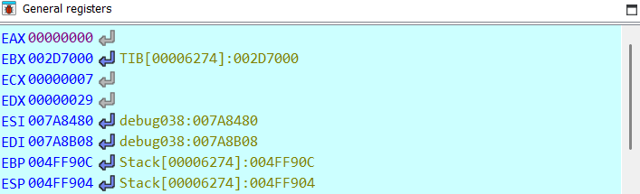

# WinAntiDbg0x100 Writeup
Description: This challenge will introduce you to 'Anti-Debugging.' Malware developers don't like it when you attempt to debug their executable files because debugging these files reveals many of their secrets! That's why, they include a lot of code logic specifically designed to interfere with your debugging process.
Now that you've understood the context, go ahead and debug this Windows executable!
This challenge binary file is a Windows console application and you can start with running it using cmd on Windows.
Challenge can be downloaded here. Unzip the archive with the password picoctf
## 1. Disasembling the Binary using IDA
After disassembling the binary and looking for flag, we can see that flag will print at location `loc_CD165A`.
🚩Goal is to run till `loc_CD165A`

⚠️ But it seems that the program detect if we are debugging it or not at `loc_CD15E7`

---

## 2. Bypassing Anti-Debugging
From the assembly code, we can see that the program checks if the debugger is attached using `IsDebuggerPresent` function through `test eax,eax` and if eax is diff(not 0) it will jump to another location that will end the program.

There are several ways to bypass this check, but I'll go ahead with just modified the eax register to 0 before the `test eax,eax` instruction. This can be done with in IDA by add breakpoint at test instrufction.

🟢 Then run the program, after it stop at the breakpoint set eax to 0.

We can see in register window that eax is now 0.

Then let program run to the end, and we can see the flag printed in the console.
---
## 3. Flag

Here we can see the flag. 