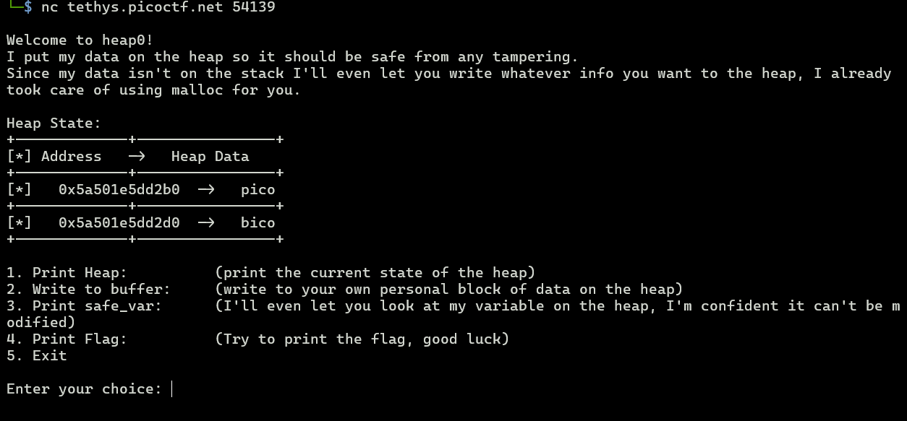
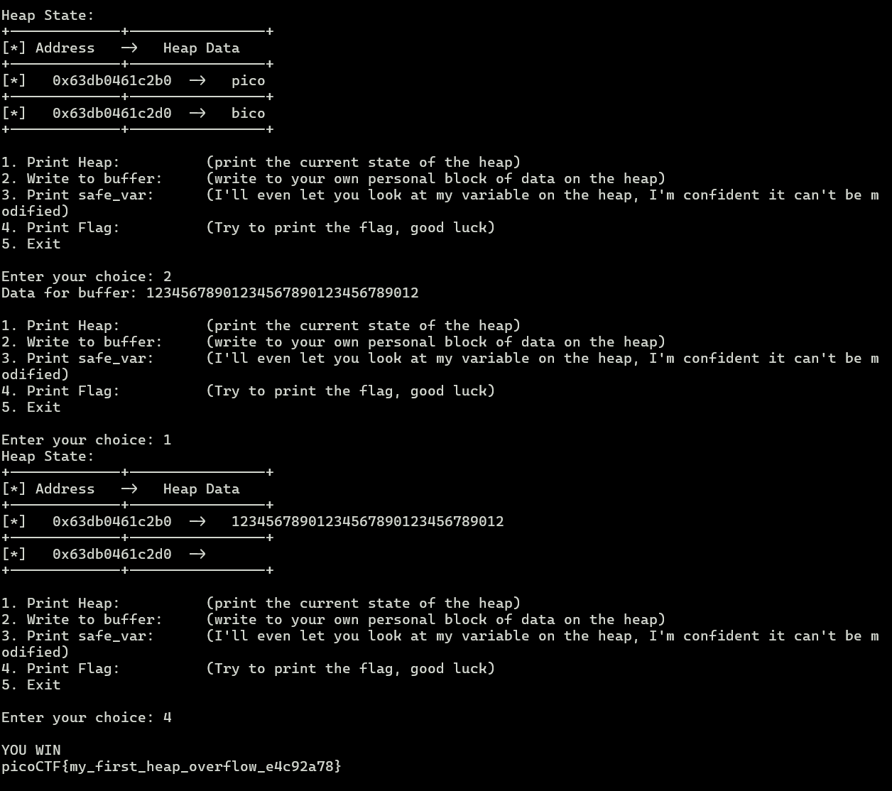

# heap 0
Description: Are overflows just a stack concern?

1. **Inspect source code**
To print flag, I need to done `check_win()` function. Which cheked if safe_var is not equal to "bico".
```c
void check_win() {
    if (strcmp(safe_var, "bico") != 0) {
        printf("\nYOU WIN\n");

        // Print flag
        char buf[FLAGSIZE_MAX];
        FILE *fd = fopen("flag.txt", "r");
        fgets(buf, FLAGSIZE_MAX, fd);
        printf("%s\n", buf);
        fflush(stdout);

        exit(0);
    } else {
        printf("Looks like everything is still secure!\n");
        printf("\nNo flage for you :(\n");
        fflush(stdout);
    }
}
```

but we can't change `safe_var`. Only `input_data` can be change by `write_buffer()` function.
```c
void write_buffer() {
    printf("Data for buffer: ");
    fflush(stdout);
    scanf("%s", input_data);
}
```

2. **Analyze the binary**
`safe_var` and `input_data` are pointers to their own addressess with malloc size of `SAFE_VAR_SIZE` and `INPUT_DATA_SIZE` respectively.
```c
#define FLAGSIZE_MAX 64
// amount of memory allocated for input_data
#define INPUT_DATA_SIZE 5
// amount of memory allocated for safe_var
#define SAFE_VAR_SIZE 5

void init() {
    printf("\nWelcome to heap0!\n");
    printf(
        "I put my data on the heap so it should be safe from any tampering.\n");
    printf("Since my data isn't on the stack I'll even let you write whatever "
           "info you want to the heap, I already took care of using malloc for "
           "you.\n\n");
    fflush(stdout);
    input_data = malloc(INPUT_DATA_SIZE);
    strncpy(input_data, "pico", INPUT_DATA_SIZE);
    safe_var = malloc(SAFE_VAR_SIZE);
    strncpy(safe_var, "bico", SAFE_VAR_SIZE);
}
```

Since we can write to `input_data` by scanf which not handle buffer overflow.

3. **Run the program**


we know that 
`input_var` is at 0x5a501e5dd2b0
`safe_vat` is at 0x5a501e5dd2d0  
which diff is 32bytes -> 32 ASCII characters needed to overwrite `safe_var` with `input_data`.


and that's it! after writing 32 characters to `input_data` we can call print flag to call `check_win()` function and print the flag.