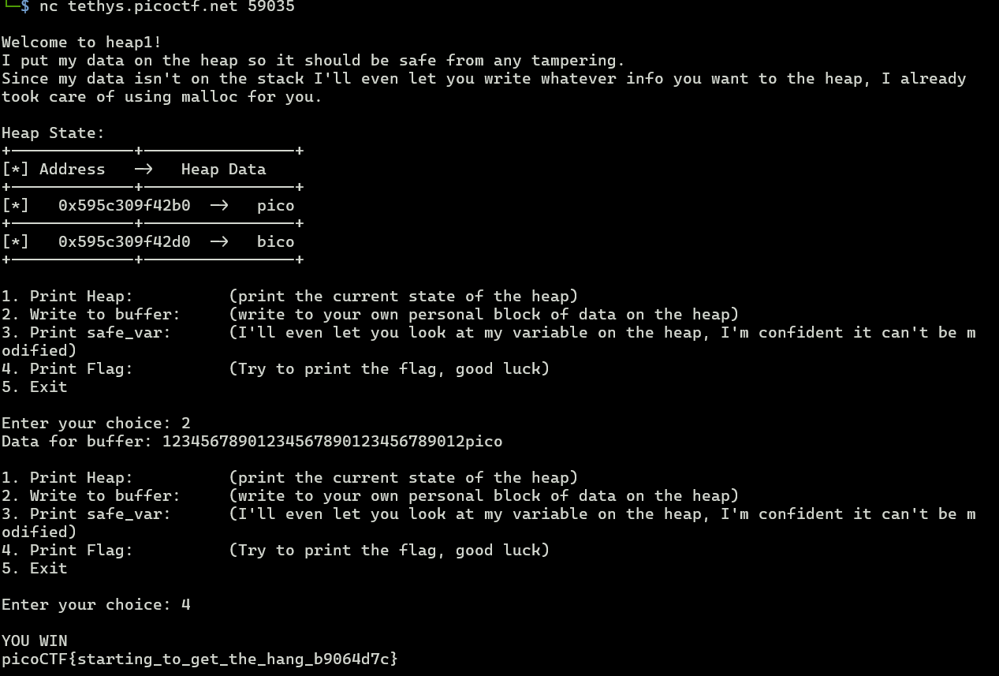

# heap 1
Description: Can you control your overflow?


1. **Inspect source code**
To print flag, I need to done `check_win()` function. Which cheked if `safe_var` has same string as "pico".
```c
void check_win() {
    if (!strcmp(safe_var, "pico")) {
        printf("\nYOU WIN\n");

        // Print flag
        char buf[FLAGSIZE_MAX];
        FILE *fd = fopen("flag.txt", "r");
        fgets(buf, FLAGSIZE_MAX, fd);
        printf("%s\n", buf);
        fflush(stdout);

        exit(0);
    } else {
        printf("Looks like everything is still secure!\n");
        printf("\nNo flage for you :(\n");
        fflush(stdout);
    }
}
```

This one has the same goal as the previous one, but this time we just have to control the string stored at the address of `safe_var` to be pico. watch detailed step [here](../heap_0/README.md)

3. **Run the program**


we know that 
`input_var` is at 0x5a501e5dd2b0
`safe_vat` is at 0x5a501e5dd2d0  
which diff is 32bytes -> 32 ASCII characters needed to overwrite `safe_var` with `input_data`. And we need to write "pico" at the end of `input_data`. So, just put random 32 characters and "pico" at the end of `input_data` to overwrite `safe_var` with "pico".


and that's it! after writing 32 characters + 'pico' to `input_data` we can call print flag to call `check_win()` function and print the flag.