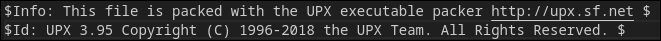
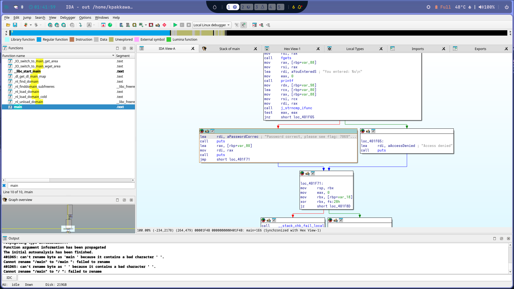
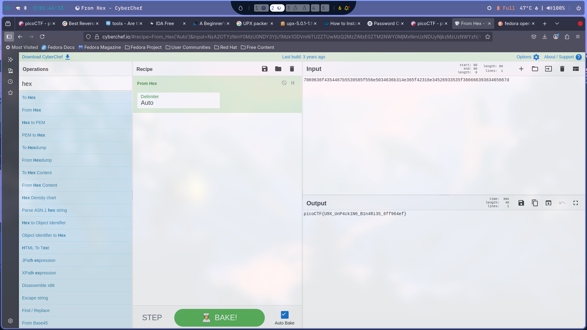

# Approach

1. **Extracting Strings**

    I started by running `strings out` on the binary. In the output, I noticed the following:

    

    After some research, I discovered that `upx` is a packing tool used to compress executables. To analyze the binary further, I installed the UPX CLI tool and decompressed the file, resulting in `out_unpacked`.

2. **Unpacking the Binary**

    I used the following command to unpack the binary:

    ```
    upx -d out
    ```

    With the unpacked binary, I opened it in IDA to reverse engineer and inspect the assembly code, as shown in the screenshot below:

    

3. **Retrieving the Flag**

    From the analysis, I found the encrypted flag. I used CyberChef to decrypt it, and the challenge was solved.

    
