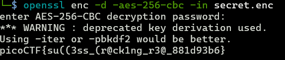

## RSA Oracle Writeup
Description: Can you abuse the oracle? An attacker intercepted communications between a bank and a fintech company. They obtained the encrypted message (ciphertext) and the password used for encryption. Additional details will be available after launching the challenge instance.

---
#### 1. Understanding the Program
After running the program via `nc`, it became clear that it implements RSA encryption. The encryption and decryption formulas are as follows:
- **Encryption:** `c = m^e mod n`
- **Decryption:** `m = c^d mod n`

---

#### 2. Researching RSA Vulnerabilities
Initially, attempts were made to reverse-engineer the program to extract `n`, `e`, and `d`, but these were unsuccessful. Further research revealed that RSA is vulnerable to **homomorphic encryption**. This property allows manipulation of ciphertexts without decrypting them:
- If `c1 = m1^e mod n` and `c2 = m2^e mod n`, then:
  - `c1 * c2 = (m1 * m2)^e mod n`

Using this property, we can exploit the oracle to recover the original message (`m1`) from `password.enc`.

---

#### 3. Exploiting RSA Homomorphic Encryption
The following Python script demonstrates how to recover the original message (`m1`) from `password.enc`:

```python
# This script exploits RSA's vulnerability to homomorphic encryption.
# c1 * c2 = pow(m1 * m2, e, n)
# If c1 = pow(m1, e, n) and c2 = pow(m2, e, n), then c1 * c2 = pow(m1 * m2, e, n)

c1 = open('password.enc', 'r').read().strip()
c1 = int(c1)
m2 = int(input("Enter message as HEX (m2): "), 16)
c2 = int(input("Enter ciphertext from oracle (c2 = E(m2)): "))

c3 = c1 * c2
print(f"Have the oracle decrypt this message (c3 = c1 * c2): {c3}\n")
m3 = int(input("Enter decrypted ciphertext as HEX (m3 = D(c3)): "), 16)
m1 = m3 // m2
print(f"Password (m1 = m3 / m2) as HEX: {m1}")
print(f"Password (m1 = m3 / m2) as ASCII: {bytes.fromhex(hex(m1)[2:]).decode('utf-8')}")
```

---

#### 4. Decrypting `secret.enc`
After recovering the original password, the next step is to decrypt the `secret.enc` file. The file begins with the prefix `Salted__`, which indicates that it was encrypted using OpenSSL.

```bash
secret.enc
Salted__A�d��7Kto�S.R�ȱ�s�j�+i�)�
�Q����t*�$����Wqt�Qw����^Q
```
Using the recovered password, the file can be decrypted with OpenSSL
---

### Final Output
After decrypting `secret.enc`, the flag is revealed

